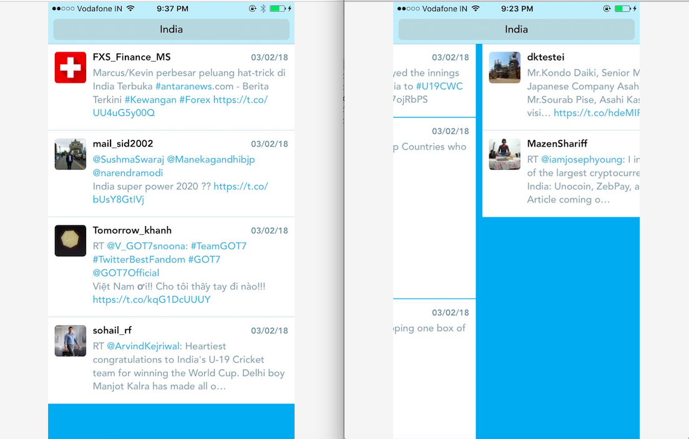

# TwitterStreamingClient

Realtime display of the latest 5 tweets associated with keyword.

Twitter provides an endpoint that delivers a continuous stream of tweets filtered by a keyword (https://stream.twitter.com/1.1/statuses/filter.json?track=India)

Further details of the APIs can be found at https://dev.twitter.com/docs/streaming-apis.

MVVM architecure used for this app.
